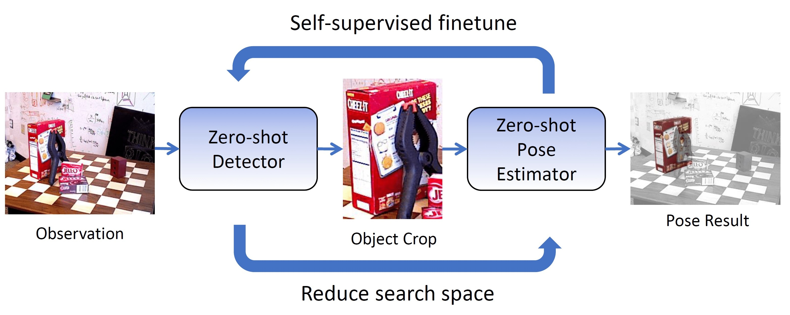

# OSSID: Online Self-Supervised Instance Detection (and for) Pose Estimation

OSSID is a self-supervised pipeline for object instance detection by, and for, 6D pose estimation. The results of a zero-shot 6D pose estimation method ([Zephyr](https://arxiv.org/abs/2104.13526)) used to finetune a zero-shot detector online. Then the detection results in turn provide object bounding boxes and reduce the search space for pose estimation. OSSID enables detection and pose estimation to adapt to new objects and environments online, without the need of no manual annotation. OSSID achieve the state-of-the-art results on YCB-V and LM-O datasets. 

[[Arxiv]](https://arxiv.org/abs/2201.07309)
[[Project Page]](https://georgegu1997.github.io/OSSID/)



## Setup

1. Clone this repo. Update the path to this repo as `OSSID_ROOT` in [config.py](https://github.com/r-pad/OSSID_code/blob/master/python/ossid/config.py). 
```
git clone git@github.com:r-pad/OSSID_code.git
```

2. We recommend building the environment and installing all required packages using Anaconda. Also pip install this repo
```
cd OSSID_code
conda env create -n ossid --file env.yml
conda activate ossid
pip install -e .
```

3. Clone and pip install the following libraries. Update the path to [bop_toolkit](https://github.com/thodan/bop_toolkit) source code as `BOP_TOOLKIT_PATH` in [config.py](https://github.com/r-pad/OSSID_code/blob/master/python/ossid/config.py). 
```
git clone git@github.com:r-pad/quat_math.git
cd quat_math; pip install .; cd ..
git clone git@github.com:r-pad/object_pose_utils.git
cd object_pose_utils; pip install .; cd ..
git clone git@github.com:r-pad/bop_toolkit.git   # We have only tested with our own fork of bop_toolkit
cd bop_toolkit; pip install -e .; cd ..
```

4. Set up Zephyr by following the instructions [here](https://github.com/r-pad/zephyr). Note that we will use the same conda environment, so please skip the first step in "Set up environment" and follow the step 2, 3 and 4 in the conda environment `ossid`. 
Also note that [MVTec Halcon](https://www.mvtec.com/products/halcon/?pk_campaign=EN-Halcon&pk_medium=cpc&pk_kwd=) needs to be set up to run the entire pipeline. This repo is tested with [Halcon 21.05](https://www.mvtec.com/products/halcon/newest-features/halcon-21-05) student edition, while it should work with newer version. Remeber to update the python binding [mvtec-halcon](https://pypi.org/project/mvtec-halcon/) accordingly if you use a newer version (By default, `mvtec-halcon==21050.0.0` is installed). 
```
sudo apt-get install build-essential cmake libopencv-dev python-numpy

git clone --recurse-submodules git@github.com:r-pad/zephyr.git
cd zephyr

mkdir build
cd build
cmake .. -DPYTHON_EXECUTABLE=$(python -c "import sys; print(sys.executable)") -DPYTHON_INCLUDE_DIR=$(python -c "from distutils.sysconfig import get_python_inc; print(get_python_inc())")  -DPYTHON_LIBRARY=$(python -c "import distutils.sysconfig as sysconfig; print(sysconfig.get_config_var('LIBDIR'))")
make; make install

cd .. # move to the root folder of zephyr 
pip install -e .
```

5. (For BOP Challenge evaluation) Setup the renderer needed for BOP evaluation as instructed [here](https://github.com/thodan/bop_toolkit). Update [config.py](https://github.com/r-pad/bop_toolkit/blob/master/bop_toolkit_lib/config.py) in `bop_toolkit` accordingly. Update `BOP_RESULTS_FOLDER` in OSSID `config.py` to be the same as `results_path` in bop_toolkit `config.py`. 

## Download data, checkpoints

1. Download YCB-V and LM-O datasets from [BOP challenge](https://bop.felk.cvut.cz/datasets/). The "Base Archive", "Object models" and "BOP'19/20 test images" are sufficient for running evaluation. Unzip them according to the structure described in BOP Challenge into a folder and update `BOP_DATASET_ROOT`. 

2. Download the checkpoints and preprocessed data. From [Google Drive](https://drive.google.com/drive/folders/1IgiXgQ2cc_SMB98xrPaF6cFlEIA-7tCw?usp=sharing), download all the files and placed them in `python/ossid/ckpts` and `python/ossid/data` folders accordingly. Please refer to the `readme.md` files in these two folders for the description of each file. Note that `ycbv_grid.zip` needs to be unzipped at `BOP_DATASETS_ROOT/ycbv/` folder. 

## Experiments

The following commands can be used to reproduce the results reported in our paper. First change the directory to `python/ossid/scripts/` and then run:

* **OSSID(Ours)** on LM-O in Table 1. 
```
python online_learning.py \
    --dataset_name lmo \
    --n_local_test 10 \
    --finetune_interval 32 \
    --finetune_epochs 1 \
    --always_dtoid_mask \
    --use_pretrained_dtoid \
    --exp_name lmo_final_main
```

* **OSSID(Ours)** on YCB-V in Table 1. 
```
python online_learning.py \
    --dataset_name ycbv \
    --n_local_test 10 \
    --finetune_interval 32 \
    --finetune_epochs 1 \
    --use_sift_hypos \
    --finetune_warmup 128 \
    --always_dtoid_mask \
    --fast \
    --exp_name ycbv_final_main
```

* **OSSID(w/Conf.Filter)** on LM-O in Table 1. 
```
python online_learning.py \
    --dataset_name lmo \
    --n_local_test 10 \
    --finetune_interval 32 \
    --finetune_epochs 1 \
    --use_pretrained_dtoid \
    --exp_name lmo_final_conf
```

* **OSSID(w/Conf.Filter)** on YCB-V in Table 1. 
```
python online_learning.py \
    --dataset_name ycbv \
    --n_local_test 10 \
    --finetune_interval 32 \
    --finetune_epochs 1 \
    --use_sift_hypos \
    --finetune_warmup 128 \
    --fast \
    --exp_name ycbv_final_conf
```

* **OSSID(Transductive)** on LM-O in Table 1. 
```
python online_learning.py \
    --dataset_name lmo \
    --n_local_test 10 \
    --use_offline_dtoid \
    --no_finetune \
    --exp_name lmo_final_transductive
```

* **OSSID(Transductive)** on YCB-V in Table 1. 
```
python online_learning.py \
    --dataset_name ycbv \
    --n_local_test 10 \
    --use_sift_hypos \
    --use_offline_dtoid \
    --no_finetune \
    --fast \
    --exp_name ycbv_final_transductive
```

* **OSSID(Oracle)** on LM-O in Table 1. 
```
python online_learning.py \
    --dataset_name lmo \
    --n_local_test 10 \
    --finetune_interval 32 \
    --finetune_epochs 1 \
    --always_dtoid_mask \
    --use_pretrained_dtoid \
    --use_oracle_gt \
    --exp_name lmo_final_oracle
```

* **OSSID(Oracle)** on YCB-V in Table 1. 
```
python online_learning.py \
    --dataset_name ycbv \
    --n_local_test 10 \
    --finetune_interval 32 \
    --finetune_epochs 1 \
    --use_sift_hypos \
    --finetune_warmup 128 \
    --always_dtoid_mask \
    --fast \
    --use_oracle_gt \
    --exp_name ycbv_final_oracle
```


## Cite

If you find this codebase useful in your research, please consider citing:

```
@ARTICLE{ral2022ossid,
  author={Gu, Qiao and Okorn, Brian and Held, David},
  journal={IEEE Robotics and Automation Letters}, 
  title={OSSID: Online Self-Supervised Instance Detection by (And For) Pose Estimation}, 
  year={2022},
  volume={7},
  number={2},
  pages={3022-3029},
  doi={10.1109/LRA.2022.3145488}}

@inproceedings{icra2022ossid,
  title={OSSID: Online Self-Supervised Instance Detection by (and for) Pose Estimation},
  author={Qiao Gu, Brian Okorn, David Held},
  booktitle={2022 International Conference on Robotics and Automation (ICRA)},
  year={2022}}
```

## Reference

* We used the [PPF](http://campar.in.tum.de/pub/drost2010CVPR/drost2010CVPR.pdf) implementation provided in [MVTec HALCON](https://www.mvtec.com/products/halcon) software for pose hypothese generation. It is a commercial software but provides [free license for student](https://www.mvtec.com/company/mvtec-on-campus/licenses/student). 